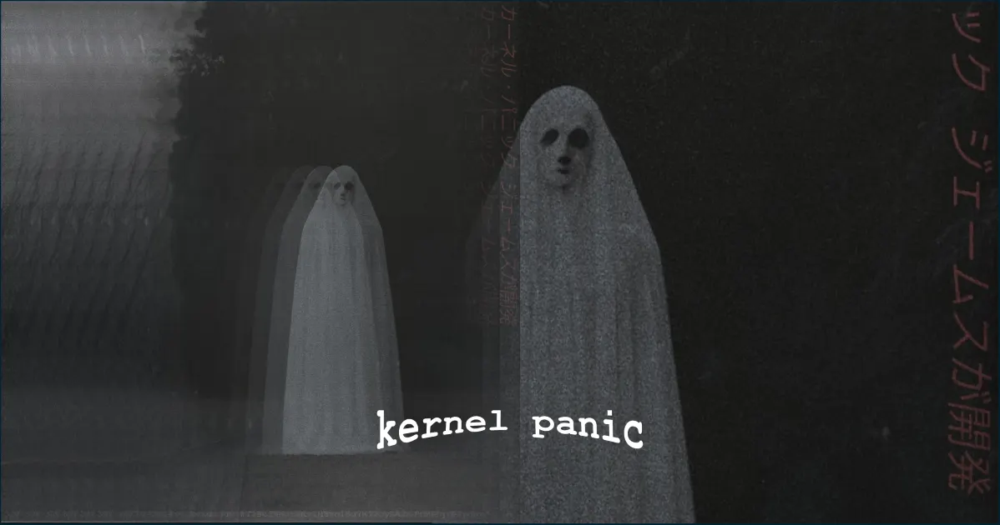

### ᴋᴇʀɴᴇʟ ᴘᴀɴɪᴄ



Una imagen no es más que una representación matemática de la realidad. Una imagen se puede alterar a nuestro gusto. Pero, ¿al alterar las imágenes que representan la realidad, estaríamos también alterando a la realidad misma?

Tú no eres el único 'tú' allá afuera. Mira el verdadero 'tú' de tu interior.

---

#### Características

- Sube tu propia foto y descubre la entidad que habita en tu interior
- Hecho tomando como base `Astro` y utilizando componentes de `React` para dibujar las "ventanas" del cliente de correo electrónico interno
- Estética retrofuturista utilizando `XP.css` para dar estilos a los elementos
- Las imágenes son transformadas utilizando la IA generativa del SDK de `Cloudinary`
- Uso de la librería `p5.js` para dibujar un fondo animado interactivo con temática de emojis de Halloween
- Descubre a Rover el perro, que muestra diferentes emociones y te hace preguntas mientras se espera finalizar la transformación de la imagen. Se hace uso del SDK de IA de Vercel conectado la IA generativa de Google

#### Sobre el proyecto

Sigue las instrucciones que se te proporcionan e intenta descubrir la alerta de amenaza inminente de avistamiento de entidades más allá de la comprensión humana. ¿Es tu casa un lugar seguro mismo? La Agencia necesita tu respuesta para que puedas seguir tu misión, por eso te solicitan enviar una foto tuya para analizarla.

#### Acerca de la configuración para ejecutar en local

- Se necesita una API Key de Google que puede ser generada gratis desde [Google AI Studio](https://aistudio.google.com/app/apikey)
- Se necesita una API Key de Cloudinary con su respectivo API Key Secret, que pueden encontrarse desde la [Consola](https://console.cloudinary.com/) > Settings > API Keys
- También se necesta el nombre de la nube de Cloduinary que puede encontrarse en el Dashboard
- Agrega un archivo `.env` con los siguientes nombres:

```
PUBLIC_CLOUDINARY_CLOUD_NAME='...'
PUBLIC_CLOUDINARY_API_KEY='...'
CLOUDINARY_API_SECRET='...'
GOOGLE_GENERATIVE_AI_API_KEY="..."
```

- En tu cuenta de Cloudinary > Programmable Media > Manage Transformations debes tener agregadas diferentes Named Transformations. Los nombres de las Named Transformations deben estar también en el archivo `OutlookAnswer.tsx` donde hay una constante llamada `actions` que contiene todas las Named Transformations, una para cada relación de aspecto
- La verificación de la relación de aspecto se hace en el cliente, para decidir más eficazmente cuál Named Transformation usar en Cloudinary. Una vez decidida la relación de aspecto, se firma la petición con el `EAGER_TRANSFORMATION` adecuado
- Por ejemplo, en mi cuenta de Cloudinary tengo una Named Transformation llamada `panic-16_9` que se encarga de procesar todas las imágenes con relación de aspecto 16:9, entonces en la constante `actions` debe estar:

```
const actions = {
    ...
    "16:9": () => {
          EAGER_TRANSFORMATION = "t_panic-16_9";
          return EAGER_TRANSFORMATION;
    }
    ...
}
```

- Nótese que se debe agregar el prefijo `t_` antes del nombre de la Named Transformation
